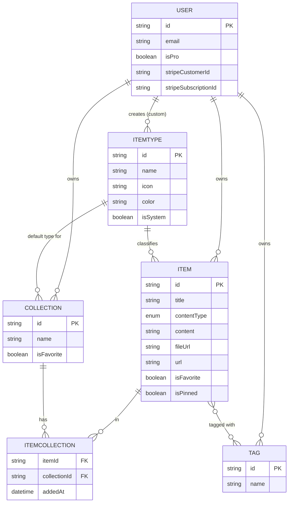
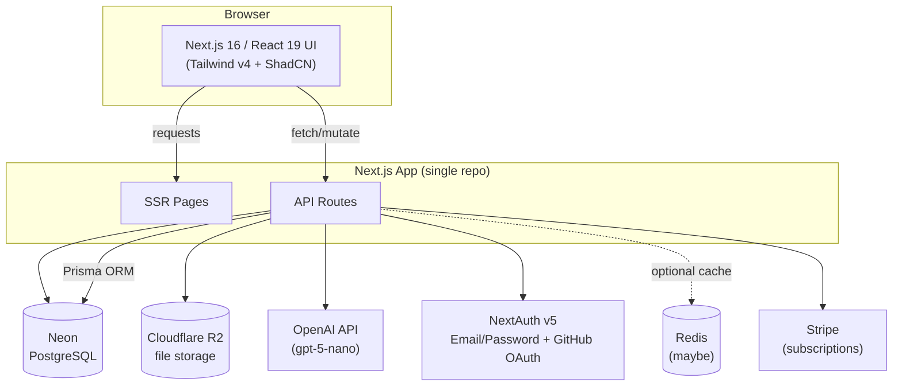

# DevStash — Project Overview

> One fast, searchable, AI-enhanced hub for all developer knowledge & resources.

---

## 1. Problem

Developers keep their essentials scattered across too many tools:

| Scattered today | Example |
|---|---|
| Code snippets | VS Code, Notion |
| AI prompts | Chat history |
| Context files | Buried in random projects |
| Useful links | Browser bookmarks |
| Docs | Random folders |
| Commands | `.txt` files |
| Project templates | GitHub Gists |
| Terminal commands | Bash history |

The result is constant context switching, lost knowledge, and inconsistent workflows. **DevStash consolidates all of it into one place.**

---

## 2. Target Users

| Persona | Needs |
|---|---|
| 🧑‍💻 Everyday Developer | Fast capture/retrieval of snippets, prompts, commands, links |
| 🤖 AI-first Developer | Save prompts, contexts, workflows, system messages |
| 🎓 Content Creator / Educator | Store code blocks, explanations, course notes |
| 🏗️ Full-stack Builder | Collect patterns, boilerplates, API examples |

---

## 3. Features

### A. Items & Item Types

Every piece of saved knowledge is an **Item** with a **Type**. Types ship as system defaults and cannot be edited/deleted; custom types are a **planned (post-launch) feature**.

| Type | Content kind | Notes |
|---|---|---|
| Snippet | text | code, syntax highlighted |
| Prompt | text | AI prompts |
| Note | text | freeform / markdown |
| Command | text | shell/CLI commands |
| Link | url | external URL |
| File | file | **Pro only** |
| Image | file | **Pro only** |

- Route convention: `/items/[type]` (e.g. `/items/snippets`)
- Items are quick-create via a **drawer** (no full page navigation)

### B. Collections

- User-defined groupings that can hold items of **any type**
- **Many-to-many**: an item can belong to multiple collections (e.g. a React snippet in both "React Patterns" and "Interview Prep")
- Examples: *React Patterns* (snippets, notes), *Context Files* (files), *Python Snippets* (snippets)

### C. Search

Full search across content, tags, titles, and types.

### D. Authentication

- Email/password
- GitHub OAuth
- via **NextAuth v5 (Auth.js)**

### E. Core Features

- Favorite items & collections
- Pin items to top
- Recently used
- Import code from a file
- Markdown editor for text types
- File upload for file/image types
- Export data (multiple formats)
- Dark mode (default) / light mode
- Add/remove an item across multiple collections
- View which collections an item belongs to

### F. AI Features (Pro only)

- AI auto-tag suggestions
- AI summaries
- "Explain this code"
- Prompt optimizer

---

## 4. Data Model

### 4.1 Entity Relationship Diagram



### 4.2 Prisma Schema

Cleaned up from the notes: added explicit relations, a `ContentType` enum, indexes, cascade deletes, and the standard NextAuth v5 tables (required by the Prisma adapter). Treat this as a **starting draft** — refine before the first migration.

```prisma
generator client {
  provider = "prisma-client-js"
}

datasource db {
  provider = "postgresql"
  url      = env("DATABASE_URL")
}

// ---------- Auth (NextAuth v5 / Auth.js Prisma adapter) ----------

model Account {
  id                String  @id @default(cuid())
  userId            String
  type              String
  provider          String
  providerAccountId String
  refresh_token     String? @db.Text
  access_token      String? @db.Text
  expires_at        Int?
  token_type        String?
  scope             String?
  id_token          String? @db.Text
  session_state     String?

  user User @relation(fields: [userId], references: [id], onDelete: Cascade)

  @@unique([provider, providerAccountId])
}

model Session {
  id           String   @id @default(cuid())
  sessionToken String   @unique
  userId       String
  expires      DateTime
  user         User     @relation(fields: [userId], references: [id], onDelete: Cascade)
}

model VerificationToken {
  identifier String
  token      String   @unique
  expires    DateTime

  @@unique([identifier, token])
}

// ---------- Core domain ----------

enum ContentType {
  TEXT
  URL
  FILE
}

model User {
  id                    String   @id @default(cuid())
  name                  String?
  email                 String   @unique
  emailVerified         DateTime?
  image                 String?
  passwordHash          String?  // null for OAuth-only accounts

  isPro                 Boolean  @default(false)
  stripeCustomerId      String?  @unique
  stripeSubscriptionId  String?  @unique

  createdAt             DateTime @default(now())
  updatedAt             DateTime @updatedAt

  accounts    Account[]
  sessions    Session[]
  items       Item[]
  itemTypes   ItemType[]
  collections Collection[]
  tags        Tag[]
}

model ItemType {
  id       String  @id @default(cuid())
  name     String
  icon     String  // lucide-react icon name
  color    String  // hex value
  isSystem Boolean @default(false)

  userId String? // null for system types
  user   User?   @relation(fields: [userId], references: [id], onDelete: Cascade)

  items                 Item[]
  defaultForCollections Collection[]

  @@unique([userId, name])
}

model Item {
  id          String      @id @default(cuid())
  title       String
  contentType ContentType

  content     String?     @db.Text // text content (snippet/prompt/note/command)
  fileUrl     String?     // Cloudflare R2 URL
  fileName    String?     // original filename
  fileSize    Int?        // bytes
  url         String?     // for link type

  description String?
  language    String?     // optional, code syntax highlighting hint

  isFavorite  Boolean     @default(false)
  isPinned    Boolean     @default(false)

  createdAt   DateTime    @default(now())
  updatedAt   DateTime    @updatedAt

  userId String
  user   User   @relation(fields: [userId], references: [id], onDelete: Cascade)

  itemTypeId String
  itemType   ItemType @relation(fields: [itemTypeId], references: [id])

  tags        Tag[]
  collections ItemCollection[]

  @@index([userId])
  @@index([itemTypeId])
  @@index([userId, isFavorite])
  @@index([userId, isPinned])
}

model Collection {
  id          String   @id @default(cuid())
  name        String
  description String?
  isFavorite  Boolean  @default(false)

  createdAt   DateTime @default(now())
  updatedAt   DateTime @updatedAt

  userId String
  user   User   @relation(fields: [userId], references: [id], onDelete: Cascade)

  defaultTypeId String?
  defaultType   ItemType? @relation(fields: [defaultTypeId], references: [id])

  items ItemCollection[]

  @@index([userId])
}

model ItemCollection {
  itemId       String
  item         Item       @relation(fields: [itemId], references: [id], onDelete: Cascade)
  collectionId String
  collection   Collection @relation(fields: [collectionId], references: [id], onDelete: Cascade)

  addedAt DateTime @default(now())

  @@id([itemId, collectionId])
  @@index([collectionId])
}

model Tag {
  id     String @id @default(cuid())
  name   String

  userId String
  user   User   @relation(fields: [userId], references: [id], onDelete: Cascade)

  items Item[]

  @@unique([userId, name])
}
```

**Open modeling questions:**

- `content` vs `fileUrl` vs `url` are mutually exclusive depending on `contentType` — enforce this at the application layer (Postgres has no native "exactly one of" constraint without a check constraint).
- Consider a Postgres `CHECK` constraint or Zod validation at the API boundary to guarantee the right field is populated per `contentType`.
- Free tier limits (50 items / 3 collections) are enforced in application logic, not the schema — worth a `@@index([userId])` count query or a cached counter on `User` if this becomes a hot path.

> ⚠️ **Reminder from your notes:** never use `prisma db push` or edit the DB directly — always `prisma migrate dev` locally, then `prisma migrate deploy` in prod.

---

## 5. Architecture



---

## 6. Tech Stack

| Layer | Choice | Docs |
|---|---|---|
| Framework | Next.js 16 / React 19 | [nextjs.org/docs](https://nextjs.org/docs) |
| Language | TypeScript | [typescriptlang.org/docs](https://www.typescriptlang.org/docs/) |
| Database | Neon (PostgreSQL, serverless) | [neon.tech/docs](https://neon.tech/docs) |
| ORM | Prisma 7 | [prisma.io/docs](https://www.prisma.io/docs) |
| Caching | Redis *(maybe)* | [redis.io/docs](https://redis.io/docs/latest/) |
| File storage | Cloudflare R2 | [developers.cloudflare.com/r2](https://developers.cloudflare.com/r2/) |
| Auth | NextAuth v5 (Auth.js) — email/password + GitHub OAuth | [authjs.dev](https://authjs.dev/) |
| AI | OpenAI `gpt-5-nano` | [platform.openai.com/docs](https://platform.openai.com/docs) |
| Styling | Tailwind CSS v4 + ShadCN UI | [tailwindcss.com/docs](https://tailwindcss.com/docs) · [ui.shadcn.com](https://ui.shadcn.com) |
| Payments | Stripe (subscriptions) | [stripe.com/docs](https://stripe.com/docs) |

**Architecture notes:**

- Single Next.js codebase — SSR pages + API routes, no separate backend service.
- ⚠️ Prisma 7 and Next.js 16 are both recent major versions — pin exact versions early and re-check migration guides against the latest docs before scaffolding, since API surface (e.g. Prisma's driver adapters, Next.js caching defaults) has shifted across recent majors.

---

## 7. Project Folder Structure

**Target** layout for the single-repo Next.js App Router setup — grouped route folders keep marketing/auth/app pages separate without affecting URLs. See "Current state" below for what exists today.

```
devstash/
├── context/                                # spec, standards, feature specs, history
├── prisma/
│   ├── schema.prisma
│   ├── seed.ts                             # system types + demo account/content
│   └── migrations/
├── scripts/
│   └── test-db.ts                          # integrity checks on the seeded data
├── public/
│   └── ...
├── src/
│   ├── app/
│   │   ├── (marketing)/
│   │   │   ├── page.tsx                    # landing page
│   │   │   └── pricing/page.tsx
│   │   ├── (auth)/
│   │   │   ├── login/page.tsx
│   │   │   └── register/page.tsx
│   │   ├── (app)/                          # authenticated area
│   │   │   ├── layout.tsx                  # sidebar shell
│   │   │   ├── page.tsx                    # dashboard / collection grid
│   │   │   ├── items/
│   │   │   │   └── [type]/page.tsx         # /items/snippets, /items/prompts, ...
│   │   │   ├── collections/
│   │   │   │   └── [id]/page.tsx
│   │   │   └── settings/page.tsx
│   │   ├── api/
│   │   │   ├── auth/[...nextauth]/route.ts
│   │   │   ├── items/route.ts              # GET (list/search), POST (create)
│   │   │   ├── items/[id]/route.ts         # GET, PATCH, DELETE
│   │   │   ├── collections/route.ts
│   │   │   ├── collections/[id]/route.ts
│   │   │   ├── tags/route.ts
│   │   │   ├── upload/route.ts             # signed R2 upload URLs
│   │   │   ├── ai/
│   │   │   │   ├── tag/route.ts            # auto-tag suggestions
│   │   │   │   ├── summarize/route.ts
│   │   │   │   ├── explain/route.ts        # explain this code
│   │   │   │   └── optimize-prompt/route.ts
│   │   │   ├── export/route.ts
│   │   │   └── stripe/
│   │   │       ├── checkout/route.ts
│   │   │       └── webhook/route.ts
│   │   ├── layout.tsx                      # root layout, theme provider
│   │   └── globals.css                     # Tailwind v4 `@theme` config + layout classes
│   ├── components/
│   │   ├── ui/                             # shadcn-generated primitives
│   │   ├── dashboard/                      # stat cards + one component per section
│   │   ├── items/
│   │   │   ├── item-card.tsx
│   │   │   ├── item-drawer.tsx             # quick create/view drawer
│   │   │   └── item-form.tsx
│   │   ├── collections/
│   │   │   ├── collection-card.tsx
│   │   │   └── collection-grid.tsx
│   │   ├── search/
│   │   │   └── search-bar.tsx
│   │   └── layout/
│   │       ├── sidebar.tsx
│   │       └── mobile-nav-drawer.tsx
│   ├── lib/
│   │   ├── prisma.ts                       # Prisma client singleton + Neon adapter
│   │   ├── auth.ts                         # NextAuth v5 config
│   │   ├── r2.ts                           # Cloudflare R2 client
│   │   ├── openai.ts                       # OpenAI client (gpt-5-nano)
│   │   ├── stripe.ts
│   │   ├── db/                             # server-side query modules
│   │   │   ├── collections.ts
│   │   │   ├── items.ts
│   │   │   ├── item-types.ts
│   │   │   └── user.ts
│   │   ├── validations/                    # Zod schemas
│   │   │   ├── item.ts
│   │   │   └── collection.ts
│   │   └── utils.ts
│   ├── hooks/
│   │   ├── use-items.ts
│   │   └── use-collections.ts
│   ├── types/
│   │   └── index.ts
│   ├── constants/
│   │   └── item-types.ts                   # icons + Pro-gated slugs (Section 9)
│   └── generated/prisma/                   # Prisma client output — gitignored
├── .env.local
├── .env.production
├── .env.example
├── components.json                         # shadcn config
├── eslint.config.mjs
├── next.config.ts
├── postcss.config.mjs                      # Tailwind v4 plugin — no tailwind.config.ts
├── prisma.config.ts                        # Prisma 7 CLI config (schema, seed, datasource)
├── package.json
└── tsconfig.json
```

**Notes:**

- Route groups `(marketing)`, `(auth)`, `(app)` share the `app/` URL namespace but get separate layouts — e.g. `(app)/layout.tsx` renders the sidebar shell only for logged-in pages.
- `lib/` holds all third-party client singletons (Prisma, R2, OpenAI, Stripe) so API routes import one shared instance instead of re-initializing per request.
- `lib/db/` holds the read queries server components call directly; each module owns its own `select` and returns a narrow summary type rather than a raw Prisma model.
- `constants/item-types.ts` is the single source of truth for system type icons and Pro gating — reused by the sidebar and item cards. Type *colors* live in `globals.css` as `--type-*` custom properties, not here, since only CSS consumes them.
- Tailwind v4 is configured in CSS via `@theme` in `globals.css`. There is **no** `tailwind.config.ts` — see @context/coding-standards.md.

**Current state (2026-08-16):**

The route groups above are not in place yet. Everything built so far lives under a plain `src/app/dashboard/` route:

```
src/app/
├── dashboard/
│   ├── layout.tsx                          # sidebar shell — async server component
│   └── page.tsx                            # stats, collection grid, pinned + recent items
├── layout.tsx                              # root layout, dark by default
├── globals.css
└── page.tsx                                # `<h1>Devstash</h1>` placeholder
```

Deferred until auth lands, at which point the dashboard moves to `(app)/page.tsx` and the placeholder root page becomes `(marketing)/page.tsx`. There is no `api/` directory yet — data is read directly in server components through `lib/db/`. `lib/auth.ts`, `lib/r2.ts`, `lib/openai.ts`, `lib/stripe.ts`, `lib/validations/`, `hooks/`, `types/`, `components/search/` and `components/items/item-drawer.tsx` are all still unwritten.

---

## 8. Monetization

Freemium. Foundation for Pro gating should exist from day one, but **during development, all users get full access.**

| | Free | Pro — $8/mo or $72/yr |
|---|---|---|
| Items | 50 total | Unlimited |
| Collections | 3 | Unlimited |
| System types | All except File/Image | All, including File/Image |
| Custom types | ✗ | ✗ *(planned, not at launch)* |
| Search | Basic | Basic |
| File & image uploads | ✗ | ✓ |
| AI auto-tagging | ✗ | ✓ |
| AI code explanation | ✗ | ✓ |
| AI prompt optimizer | ✗ | ✓ |
| Data export | ✗ | ✓ (JSON/ZIP) |
| Support | Standard | Priority |

---

## 9. UI / UX

### Design language

Modern, minimal, dev-focused. Dark mode by default, light mode optional. Clean typography, generous whitespace, subtle borders/shadows.

### Design references

Notion, Linear, Raycast. Syntax highlighting on all code blocks.

### Screenshots

Refer to the screenshots below for the dashboard UI. It does not have to be exact. Use it as a reference:
@context/screenshots/dashboard-ui-main.png
@context/screenshots/dashboard-ui-drawer.png

### Layout structure

- Collapsible sidebar (types + links to their items, latest collections) → becomes a drawer on mobile
- Main area: grid of collection cards, background color-coded by the item type they contain most of; items inside show as border color-coded cards by type
- Items open in a quick-access drawer, not a full page
- Desktop-first, mobile-usable

**Micro-interactions:** smooth transitions, hover states on cards, toast notifications, loading skeletons.

### Type Colors & Icons

Icon names below refer to [lucide-react](https://lucide.dev/icons/) (already a ShadCN dependency).

| Type | Color | Swatch | Icon |
|---|---|---|---|
| Snippet | `#3b82f6` | 🔵 | `Code` |
| Prompt | `#8b5cf6` | 🟣 | `Sparkles` |
| Command | `#f97316` | 🟠 | `Terminal` |
| Note | `#fde047` | 🟡 | `StickyNote` |
| File | `#6b7280` | ⚪ | `File` |
| Image | `#ec4899` | 🩷 | `Image` |
| Link | `#10b981` | 🟢 | `Link` |

---

## 10. Open Items / Decisions Needed

- [ ] Redis: confirm whether caching is needed pre-launch or deferred (marked "maybe" in notes)
- [ ] Export formats: confirm which are in scope beyond JSON/ZIP
- [ ] Enforce free-tier limits (50 items / 3 collections) — decide hard block vs. soft warning UX
- [ ] Custom item types: not in v1 scope, but `ItemType.userId` is already modeled to support it later
- [ ] Content-type field validation (`content` / `fileUrl` / `url` mutual exclusivity) — app-layer or DB check constraint
- [ ] Confirm exact Prisma 7 / Next.js 16 API changes against current docs before scaffolding migrations
